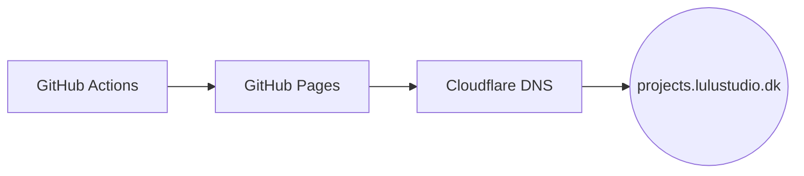

# § LuluStudio Hub

**One public home for LuluStudio: desktop apps, Discord bots, and tooling for
[Albion Online](https://albiononline.com) and Whiteout Survival.**

&nbsp;

### [Open the site →](https://projects.lulustudio.dk) &nbsp;·&nbsp; [AlbionPacketExplorer](https://projects.lulustudio.dk/apx/) &nbsp;·&nbsp; [Bots](https://projects.lulustudio.dk/bots/)

---

## What is this

The repository behind **[projects.lulustudio.dk](https://projects.lulustudio.dk)**: a small,
**hand-written static site** (no framework, no build step) that showcases LuluStudio's projects and
bots and hosts desktop **downloads**. Cards are generated from live GitHub data (language, commit
activity, dates) and each one expands to a details view with a commit sparkline and a language
breakdown. Desktop apps auto-update from a feed the site serves.

## What's inside

### Apps and projects
| Project | What it does | Stack |
|---|---|---|
| **[AlbionPacketExplorer](https://projects.lulustudio.dk/apx/)** | Captures Albion's network traffic live and decodes every packet, for protocol reverse-engineering. Self-updating desktop app. | C# · Avalonia |
| **wos-java-bot** | Automates Whiteout Survival by driving Android emulators. | Java |

### Bots
All three are Discord bots, self-hosted via Docker, each with its own job. See them on the
**[bots page →](https://projects.lulustudio.dk/bots/)**

| Bot | What it does | Stack |
|---|---|---|
| **The Discord Butler** | Albion info: item lookup, live market prices, crafting bonuses, guild utilities. | Python |
| **MICAR Discord** | Guild bot: objective tracking, black-zone map data, guild utilities. | Node.js |
| **discord-utc-bot** | TimeKeeper: tracks members' UTC offsets and shows local times. | Node.js |

## How it works

- **Static site** built by hand in [`site/`](site/); GitHub Actions publishes it to GitHub Pages,
  with the domain pointed by Cloudflare DNS.
- **Cards** come from [`site/js/data.js`](site/js/data.js), generated from live GitHub repo
  metadata and commit activity, so they stay honest.
- **Auto-update:** installed desktop apps update themselves from a feed the site serves; nothing to
  configure on the user's side.
